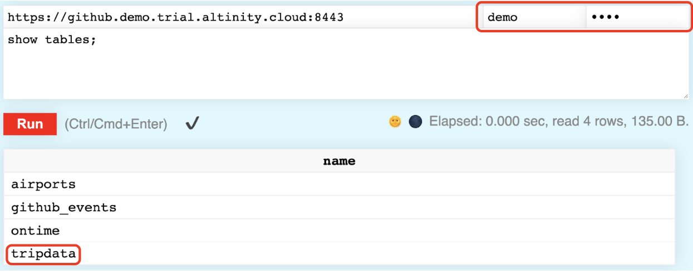
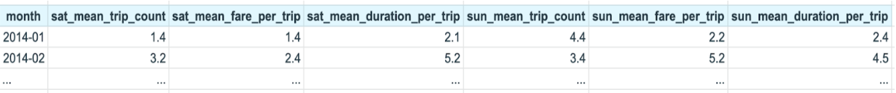

# ClickHouse-to-SQLite-Airflow-Pipeline
This repository hosts the codebase for a data pipeline designed to extract data from a ClickHouse database and store it in an SQLite database within an Airflow environment

# README Documentation: ClickHouse to SQLite Data Pipeline with Airflow

## Project Overview:
This project aims to create a data pipeline that retrieves information from an external ClickHouse database and stores it in an SQLite database named 'airflow.db'. The pipeline is designed to run within an Apache Airflow environment, which is deployed using Docker containers for easy setup and management.

## How to Access the Database:

The database can be accessed through a web browser by visiting the following link: [ClickHouse Web Interface](https://github.demo.trial.altinity.cloud:8443/play). Use `demo` as your username and password (top left corner of the page).



The dataset you will be working with is stored in the `tripdata` table. The column names are self-explanatory, but note that we are interested in the `fare_amount`, and not the other amount columns available in the table.

## Task:

Write an SQL query to fetch the following monthly metrics from the dataset for the interval between 1st January 2014 and 31st December 2016:

- The average number of trips on Saturdays
- The average fare (`fare_amount`) per trip on Saturdays
- The average duration per trip on Saturdays
- The average number of trips on Sundays
- The average fare (`fare_amount`) per trip on Sundays
- The average duration per trip on Sundays

The output of the query should be in a format similar to this:



## Installation Instructions:
To run this project, follow these steps:

1. **Install Docker Compose:**
   Ensure that Docker Compose is installed on your system.

2. **Start Airflow Services with Docker Compose:**
   Use Docker Compose to start the Airflow services defined in the `docker-compose.yml` file.
   ```bash
   docker-compose up -d
   ```
   This command will start the Airflow services in detached mode, allowing them to run in the background.

3. **Access Airflow UI:**
   Open your web browser and navigate to [http://localhost:8080](http://localhost:8080) to access the Airflow web interface.
   - Username: `admin`
   - Password: `admin`

## Project Components:

1. **External ClickHouse Database:**
   The project interacts with an external ClickHouse database to retrieve data.

2. **Airflow DAG:**
   The main workflow of the project is defined using an Airflow DAG. The DAG orchestrates the execution of tasks involved in querying the ClickHouse database, processing the retrieved data, and inserting it into the SQLite database.

3. **ClickHouse Data Extraction:**
   Data is extracted from the ClickHouse database using SQL queries (`trip_data_query.sql`) stored in separate files. The `extract_data()` function retrieves data from ClickHouse using the provided credentials and query.

4. **SQLite Database:**
   An SQLite database named 'airflow.db' is used to store the extracted data. The `create_table()` function was used to create a table in the database using the `create_table.sql` query. The `insert_table()` function processes the data and inserts it into a 'tripdata' table within the SQLite database using the `insert_table.sql` query.

## Execution:
Once the Airflow environment is set up and the DAG is configured, the data pipeline will automatically execute. The pipeline will query the ClickHouse database, process the data, and insert it into the SQLite database as specified in the DAG.

For any further assistance or queries, feel free to reach out to the project maintainers.
